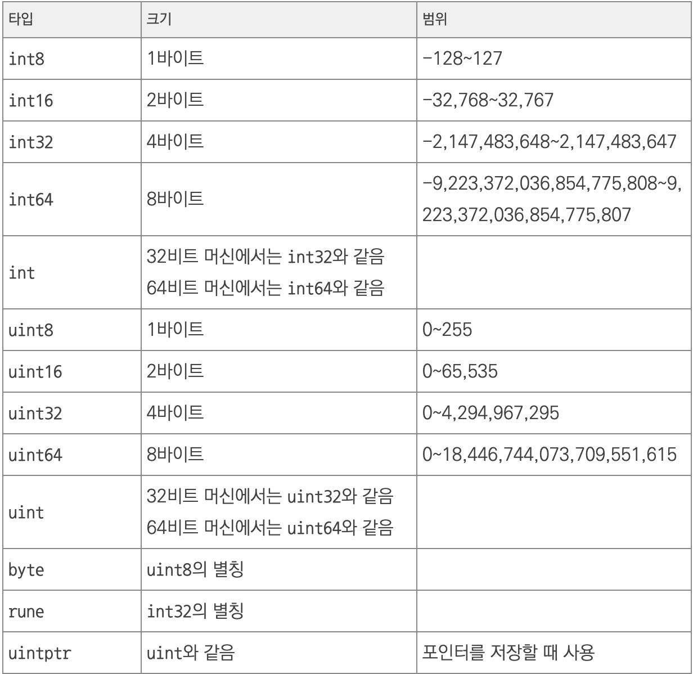

# **숫자**
- Go의 **정수, 실수, 복소수**에는 **다양한 타입**이 있다.
- 그래서 프로그램에서 **요구하는 상황**에서 가장 **알맞은 숫자 타**입을 선택해서 사용할 수 있다.

 

---
## **정수**

**정수 타입과 범위**

 

### **8진수와 16진수 표기**
- 기본적으로 모든 정수는 10진수로 인식된다.
- 8진수는 숫자 앞에 0을 붙히고 16진수는 숫자 앞에 0x를 붙인다.

~~~go
// 8진수와 16진수 사용

package main

import "fmt"

func main() {
    a := 365    // 10 진수
    b := 0555   // 8 진수
    c := 0x16D  // 16 진수

    fmt.Println(a, b, c)
}
~~~

~~~
실행 결과

365 365 365
~~~

 

---
## **문자 표기**
- Go는 **정수** 타입과 **문자** 타입을 **구분하지 않는다.**

- **바이트**(byte) 또는 **룬**(rune) 타입으로 **문자의 코드값**을 저장하여 문자를 표기한다.
    - **byte**는 **uint8**의 별칭으로 **1 바이트**를 표현할 수 있는 **아스키**(ASCII) 문자를 표기할 수 있다.
    - **rune**은 **int32**의 별칭으로 **유니코드**(UTF-8) 문자를 표기할 수 있다.

~~~go
var ch1 byte = 65       // 65 (10 진수)
var ch2 byte = 0101     // 65 (8 진수)
var ch3 byte = 0x41     // 65 (16 진수)

var ch4 rune = 44032    // 44032 (10 진수)
var ch5 rune = 0126000  // 44032 (8 진수)
var ch6 rune = 0xAC00   // 44032 (16 진수)

fmt.Printf("%c %c %c\n", ch1, ch2, ch3)
fmt.Printf("%c %c %c\n", ch4, ch5, ch6)
~~~
~~~
실행 결과

A A A
가 가 가
~~~

 

- 문자 코드값이 아니라 **문자 자체를 지정**할 때는 **작은 따옴표**(')를 사용한다.
~~~go
var ch1 byte = 'A'
var ch2 rune = '가'

fmt.Printf("%c %c\n", ch1, ch2)
~~~
~~~
실행 결과

A 가
~~~