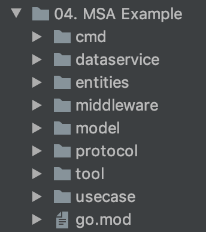

# **MSA Example**

## **시작하기 전에...**
- **크리스 리처드슨**의 **[마이크로서비스 패턴](https://www.aladin.co.kr/shop/wproduct.aspx?ItemId=228694618)** 책을 읽고 많은 유용한 지식을 얻을 수 있었으며
- **jfeng45**님의 **[github 레포지토리](https://github.com/jfeng45/servicetmpl)** 와 **[medium 블로그](https://medium.com/@jfeng45/go-micro-service-with-clean-architecture-application-layout-e6216dbb835a)** 에서 많은 도움을 받았습니다.

 

---
## **목차**
### **[1. 프로젝트 계기](#프로젝트-계기)**
### **[2. 서비스 분해](#서비스-분해)**
### **[3. 서비스 실행 과정](#서비스-실행-과정)**
### **[4. 공통 패턴](#공통-패턴)**
### **[5. 적용하지 못한 패턴](#적용하지-못한-패턴)**
### **[6. 프로젝트 구조](#프로젝트-구조)**

 

---
## **프로젝트 계기**
**Building Microservices with Go** 책을 읽고 3강을 정리한 후에 **go언어에 대한 익숙함**과 **MSA에 대한 기본적인 이론**은 익혔다고 생각하였습니다.  

하지만 막상 MSA 기반의 개인 프로젝트를 진행하려고 하니 **전자인 익숙함은 익혔을지라도 후자인 이론은 너무 허실하고 부족**하여 이 프로젝트를 어떻게 시작해야할지 감이 전혀 안오고 **너무 막막했습니다.**   

따라서 제가 결정한게 위에서 말씀드린 **마이크로서비스 패턴**이라는 책을 사서, 실제 MSA 서비스를 위한 **탄탄한 기본 지식뿐만 아니라, 프로젝트에 도입할 수 있는 용기**를 쌓는 것이였습니다.  

그렇게 해서 만들게된 것이 **4강인 MSA Example**으로, 생각했던 시간이 코드를 짰던 시간보다 **10배는 많을 정도**로 대충 짠것이 절대 아닌, 온갖 스트레스와 프로젝트 구조에 대한 막막하고 두려운 감정을 **오직 해내고 싶다는 마음 하나로 이겨내면서 만든 것**임을 꼭 알아주셨으면 합니다.     

앞으로 나오는 내용들은 매우 **주관적인 의견**이며 **아키텍쳐를 적용해보는 것이 목표**였기 때문에 실제 서비스에 필요한 부가적인 기능들(암호화, 로깅 등등)은 구현하지 않았음을 참고해 주세요.  

그러면 이제부터 제 프로젝트에 도입된 **프로젝트 구조와 공통 패턴들**을 알려드리겠습나다.

 

---
## **서비스 분해**
<del>*아직 맛보기로 회원가입 기능만 구현하였습니다*<del>

- ### **Api Gateway**
    - 사용자의 HTTP 요청을 분석하여 **여러 서비스로 메시징**을 하는 역할을 합니다.
    - 필요에 따라 **로드밸런싱, 서버 사이드 디스커버리, JWT 인증**등의 기능을 추가할 수 있습니다.
- ### **Auth Service**
    - 사용자 아이디, 비밀번호 속성을 가지고 있는 **User 테이블을 소유**하고 있습니다.
    - **계정 정보를 관리하는 서비스**로, 계정 관리 및 회원 확인 기능의 역할을 합니다.
- ### **User Service**
    - Auth Service에서 생성된 사용자의 회원 정보(이름, 전화번호 등등)을 속성으로 가지고 있는 **UserInform 테이블을 소유**하고 있습니다.
    - **회원 정보를 관리하는 서비스**로, 회원 정보 관리 및 쿼리 기능의 역할을 합니다.

 

---
## **서비스 실행 과정**
*회원가입 서비스를 예시로 서비스들의 통신 및 실행 과정을 설명드리겠습니다.*
1. 클라이언트가 Api Gateway로 **회원가입 API 요청**
2. Api Gateway가 Auth Service가 구독하는 auth.signup 채널에 요청 정보를 포함하는 **메시지 발행 후 대기**(resp/req 방식)
3. 해당 채널을 구독하고 있는 Auth Service가 해당 메시지를 받은 후, 사용자가 **입력한 ID가 이미 사용되고 있는지 확인**
4. 사용되고 있는지만 확인한 다음, 사용중이면 fail, 사용하고 있지 않으면 success 정보를 포함한 **메시지를 Api Gateway에게 응답**
5. Api Gateway는 그 정보만 가지고 API를 호출한 클라이언트에게 **요청의 성공 여부(201 or 4XX) 반환**
6. 그리고 나서 **실제로 Auth Service에서 계정 정보를 저장**하고, row의 PK를 가지고 User Service가 구독하고 있는 **user.registry 채널에 메시지 발행**
7. UserService에서 해당 메시지를 받은 후, 그 메시지의 정보를 토대로 **DB에 회원 정보 저장**
8. 마지막으로 다시 AuthService에 **성공 여부를 포함한 메시지를 발행**하고 UserService에서 처리하면 **회원가입 서비스가 완료.**
9. 참고로 **6단계(User 생성) 이후**로 실행 과정에서 에러가 생겨서 **정상적인 처리가 불가능**할 경우, User 생성을 취소하는 **보상 트랜잭션을 실행.**

 

---
## **공통 패턴**
- **타임 아웃** 
    - 요청 및 메시지 발행 후 응답이 올 때 까지 **대기상태**가 되는데, **특정 서비스 불능 시** 무한 혹은 긴 대기 상태가 되어 **서비스 전체가 마비되는 현상을 막기 위해** 사용한 패턴입니다.

- **회로 차단** 
    - 서비스 과부하 및 외부 API의 오작동으로 **여러번 타임아웃 혹은 에러가 발생**하였을 때, 해당 서비스의 진정을 위해 특정 기간동안 **해당 서비스로부터의 요청을 막는 패턴**입니다.

- **사가 트랜잭션** 
    - 마이크로서비스 특성 상 하나의 큰 **트랜잭션이 여러 서비스에 걸쳐**있기 때문에 모놀리식 서비스와는 다르게 **로컬 트랜잭션 만으로는 트랜잭션을 처리할 수 없습니다.** 따라서 하나의 큰 트랜잭션을 관리하기 위해 사용한것이 바로 **보상 가능 트랜잭션, 피봇 트랜잭션, 재시도 가능 트랜잭션, 보상 트랜잭션**으로 이루워저 있는 [**사가 트랜잭션**](cla9.tistory.com/22)입니다.

- **시맨틱 락** 
    - 사가 트랜잭션의 특징은 **ACD**로, 트랜잭션의 기본 특징인 ACID에서 I(Isolation)인 **고립성이 보장되지 않습니다.** 따라서 이를 해결하기 위한 패턴이 **시맨틱 락**으로, **보상 가능 트랜잭션이 생성/수정하는 레코드에 플래그를 세팅**하는 대책입니다.

 

---
## **적용하지 못한 패턴**
- **메시지 순서 유지**
    - **동일한 메시지 수신자가 여럿 있는 상태**에서 순차적으로 메시지를 발행하였을 때, 네트워크 이슈나 가비지 컬렉션 문제로 **메시지 순서가 뒤바뀌는 상황**이 발생할 수 있습니다. 이런 경우 시스템의 오작동이 발생 할 수 있기 때문에, 이러한 이슈를 막기 위해 **샤드 키 값에 따라 메시지를 정해진 수신자에 전송**하는 패턴을 사용할 수 있습니다.

- **중복 메시지 처리** 
    - 어느 한 메시지 클라이언트가 메시지를 받아 로직을 수행하고, DB에 업데이트까지 **다 한 상태**인데, 중간에 어떠한 오류로 인해 **메시지 처리 완료를 실행하지 못하고 클라이언트가 중단**된 경우, 이 클라이언트를 다시 실행하면 전에 DB까지 처리한 메시지를 **다시 처리하게 될 것 입니다.** 이러한 경우를 막기 위해서 **멱등한 핸들러**를 작성해야 하는데, 처리된 **메시지의 ID를 DB 테이블에 기록**하는 것으로 이슈를 처리할 수 있습니다.

- **트랜잭셔널 메시징** 
    - 만약 위의 상황과 같이 DB까지 처리를 다 했는데 메시지를 발행하기 전에 에러가 발생해 서비스가 중단되면?? 말하지 않아도 알 것 같습니다.. 따라서 **메시지를 발행하는 것 까지 로컬 트랜잭션에 포함**시켜야 하는데, 이 것을 바로 **트랜잭셔널 메시징**이라고 합니다. 이 것을 구현할 수 있는 방법이 바로 **트랜잭션 로그 테일링**인데, **트랜잭셔널 로그마일링**이라는 놈이 **트랜잭션 로그**를 읽어 그 **변경분에 해당하는 메시지를 발행**하는 패턴입니다.

- **상태 점검**
    - 만약 서비스에 **오작동이나 장애가 발생**하였을 때, 해당 서비스를 **다시 실행시키거나 종료**하도록 해주는 엔드포인트입니다. **데이터 저장소 연결 상태, 현재 응답 시간, 현재 연결, 잘못된 요청** 등등의 정보를 기록하여 보여줄 수 있습니다. 가장 어려워 보이는 부분이 이 **상태 점검**이긴 한데, 하나씩 하나씩 구현해 보면서 언젠가는 나도 구현해 볼 수 있도록!!

 

---
## **프로젝트 구조**

-  ### **cmd**
    - 모든 마이크로서비스 **프로그램들의 시작점**으로, **main.go, server, docker-compose.yml, DockerFile**로 구성되어있습니다.
    - **main.go** - 엔드포인트를 만드는 **main 함수**로, 각각의 계층에 **의존성을 주입**하여 **서비스를 실행**시킵니다.
    - **server** - main.go 파일을 **배포 환경**인 리눅스 환경에서 실행시키기 위해 **크로스 컴파일**하여 만든 바이너리 **실행 파일**입니다.
    - **DockerFile** - 배포환경에서 서버를 실행할 Docker Container를 만들기 위해 **Docker image를 생성하는 DockerFile**입니다.
    - **docker-compose.yml** - DockerFile로 만든 이미지를 이용하여 **쉽게 컨테이너를 만들수 있게 해주는** yml 파일입니다.

- ### **dataservice**
    - 오직 **model layer에만 의존**하여 도메인 계층의 데이터를 검색하고 수정하는 **persistance layer**입니다.
    - **db_service_interface.go** - go언어로 구현된 마이크로서비스에서 제공하는 모든 **data service를 위한 인터페이스**가 있습니다. 다른 패키지들은 해당 **인터페이스에만 의존**해야 하며, DB CRUD의 세부 구현 사항에 대해 알 필요가 없습니다.
    - **테이블 이름_data_service.go** - 위에서 말씀드린 인터페이스들을 구현하는 객체들로, 의존성으론 DB 연결에 대한 객체 하나만 포함하고 있습니다. 참고로 MSA 특성 상, 특정 테이블에 접근할 수 있는 서비스는 정해져 있으므로 data service도 마찬가지로 알맞은 서비스에서 사용해야 합니다.

- ### **entities**
    - **entities**는 사용자가 호출하는 서버-클라이언트 사이의 http 통신을 위해 **json과 객체 사이에 인코딩 및 디코딩을 도와주는 객체**들을 모와놓은 폴더입니다. 
    - 참고로 **유효성 타입 검사**를 진행하기 위해서 태그를 이용합니다.

- ### **middleware**
    - **middleware**는 사용자의 **요청을 처리하기 전에** 공통으로 **수행하는 작업들**을 따로 처리하기 위해 모와둔 폴더입니다.
    - 예를 들면, 로깅을 쉽게 하기 위해 api gateway에서 **각 요청마다 X-Request-ID 값을 설정**해줘야 하는데, 이 작업은 실제 **비즈니스 로직을 실행하기 전에 수행**되어야 하므로 이러한 작업들을 **middleware로 분리**합니다.

- ### **model**
    - **model**은 MVC(Model-View-Contorller)의 **Model과 비슷한 개념**으로, 도메인 구조체를 포함하고 있는 **domain model layer**입니다.
    - DB 관련 **도메인 모델을 정의**하는데 **[gorm 패키지](https://github.com/jinzhu/gorm)** 의 도움을 받았으며 **persistance layer** 또한 마찬가지 입니다.

- ### **protocol**
    - **protocol**또한 **json과 객체 사이에 인코딩 및 디코딩을 도와주는 객체**들을 모와놓은 폴더입니다.
    - 하지만 entities와는 다르게 protocol은 서비스끼리 **Message Queue**를 이용하여 **이벤트를 발행할 때의 통신 규약**을 정하기 위한 것 입니다.
    - protocol 또한 **유효성 타입 검사**를 진행하기 위해 태그를 사용하였습니다.

- ### **tool**
    - **tool**은 [**golang standard project layout**](https://github.com/golang-standards/project-layout)의 /tools와 같이 서비스를 개발하면서 **자주 쓰일것 같은 기능들**을 묶어놓은 디렉터리로, 저의 프로젝트에는 **다음과 같은 세부 디렉토리**가 있습니다.
    - **proxy** - **proxy**는 구조체가 마샬링된 바이너리 값을 받아서 용도에 따라 해당하는 **채널에 메시지를 발행해주는 서비스 통신의 중간 매체**를 하는 객체입니다. Write 메서드가 존재하여 **io.Writer 인터페이스**를 구현하고 있습니다.
    - **encoder** - **encoder**는 필드로 저장되어있는 proxy의 **Write 메서드를 호출하는 객체**로, **json.Encoder 객체를 임베딩**하고 있습니다. 그리고 encoder의 종류(jsonEncoder, xmlEncoder)에 따라 구조체를 마샬링하는 방법이 다릅니다.
    - **message** - **message**는 다양한 방법으로 **NATS서버에 연결하여 연결 객체**를 반환하는 함수들을 가지고 있고, 반환 객체는 **nats.Conn 객체를 임베딩**하여 일부 **메서드를 오버라이딩**하여 원하는 기능을 추가하였습니다.
    - **dbc** - **dbc**는 **데이터베이스 서버와 연결하여 연결 객체를 반환**하는 함수들을 포함하고 있는 디렉터리 입니다. [**gorm**](https://github.com/jinzhu/gorm) **패키지** 를 이용해 연결을 하였고, DB 연결 해제를 위해 **시그널 핸들 기능**을 추가하였습니다.

- ### **usecase**
    - 마지막으로 usecase는 **business layer**로, 여러 상황에 따른 로직을 처리하는 usecase 객체를 포함하고 있습니다. 
    - **nats 인코더, data service 객체(DAO), 유효성 검사 객체**에 대해 **의존성**을 가지고 있습니다.
    - 참고로 http 요청을 다루는 Api Gateway의 usecase를 제외하면 다른 모든 usecase들은 메시지를 handling합니다.
