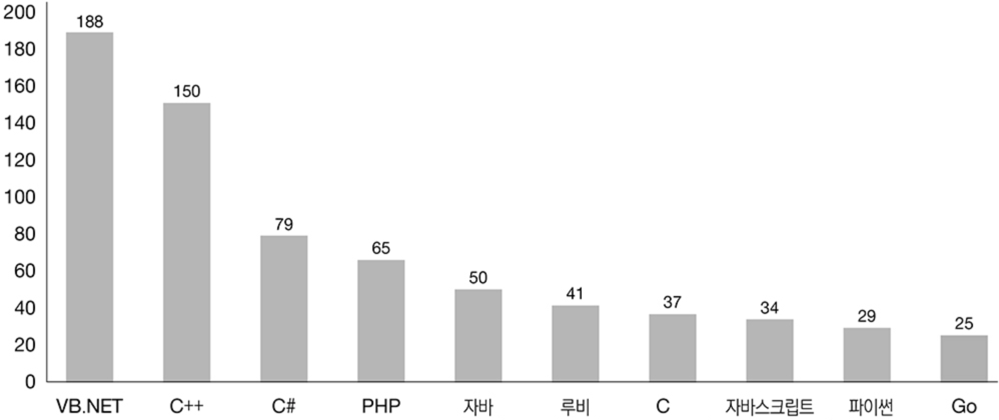
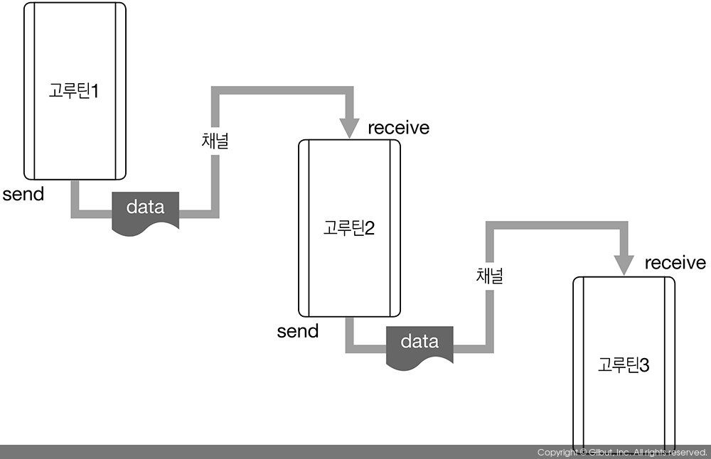

## **시작하기 전에...**  
- **장재휴 저자**님의 **Go 언어 웹 프로그래밍 철저 입문** 책에서
- 이 **README.md**에 나오는 **사진**을 **가져왔고** 앞으로 나올 **내용들**도 **보고 참조했음**을 알립니다.

 

# **Go는 어떤 언어인가?**

**Go**는 **빠른 성능, 안정성, 편의성, 쉬운 프로그래밍**을 목표로 개발되었고 **시스템 프로그래밍**부터 **웹 어플리케이션 개발**까지 **여러 분야**에서 **여러 용도**로 사용된다.

 

---
## **Go언어의 특징**
1. **간결하고 유연한 문법**
2. **병행 프로그래밍**
3. **정적 타입 언어**
4. **동적 프로그래밍**
5. **쉬운 협업**
6. **가비지 컬렉션(Garbage Collection) 제공**
7. **빠른 컴파일과 실행 속도**

 

---
## **간결하고 유연한 문법**
- 언어의 **기능**이 많고 **복잡**하면 **문제**를 **해결**하는 것보다 **기능**을 **이해**하고 **익히는 것**에 **더 많은 시간**을 할애해야 한다.
- 따라서 **Go**는 **간결**하고 **명확한 문법**에 중점을 두고 설계됐다. 그래서 코드가 **단순**해졌고 **가독성**이 높아졌다.
- **Go**를 사용하면 기억하기 쉬운 **키워드 몇몇**만으로도 **규모가 큰 어플리케이션**을 구현할 수 있다.

 

**언어별 키워드 수**

 

---
## **병행 프로그래밍**
- 지난 30여 년간 **CPU의 성능**이 **무어의 법칙**대로 18개월마다 2배씩 **빨라졌다.**
- 하지만 **한계**에 부딪힌 후, **컴퓨터 하나**에 **CPU 여러 개**를 장착해서 **CPU 여러 개**가 **동시에 계산**을 수행하게 된다.
- 따라서 **소프트웨어**도 이러한 **멀티 코어 전략**에 영향을 받아 **병행 또는 병렬 처리**를 지원하는 것이 필수 조건이 되었다.

 

**인텔 프로세서의 트랜지스터 집적수 성장과 무허의 법칙**

 

- 따라서 **Go 언어**를 설계할 때 특별히 **중점**을 둔 부분이 바로 **병행 처리**이다.
- Go의 **병행 처리 방식**은 **통신 순차 프로세스**(Communicating Sequential Processes, CSP) 방식에 근간을 둠.
- 즉, **메모리를 공유**하는 것이 아니라 **메세지를 전달하는 방식**으로 동기화한다.

 

**언어별 병행 프로그래밍의 난이도**

 

**고루틴과 채널**

- **동시에 처리**해야 하는 작업은 **고루틴**으로 실행하고, **고루틴**끼리 **메세지**를 **주고 받는 작업**은 **채널**이라는 통로를 사용한다.
- **고루틴**은 Go 프로그램 안에서 **동시에 독립적으로 실행되는 흐름의 단위**로, **스레드**와 비슷한 개념이다.
- 하지만 스레드와 달리 **매우 적은 리소스**에서 동작하므로 **한 프로세스**에 **수천, 수만 개의 고루틴**을 동작시킬 수 있다.

##  